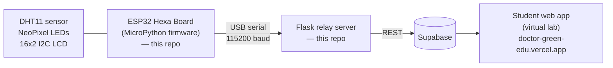

# Smart-Farm Education Program — Device & Relay Server

MicroPython firmware for an ESP32 "Hexa Board" smart-farm kit, plus the Flask relay
server that bridges it to Supabase — built for a hands-on IoT / AI crop-diagnosis
education program.

## Scope of this repository

The Smart-Farm Education Program is an exhibition-linked education case commissioned
by the **Yangpyeong Education Office** (through the museum), where students experience
an IoT smart farm and AI crop diagnosis in a guided classroom flow. The full system —
planned and built solo — spans a device layer, a relay server, and a student-facing
web app with a virtual lab.

**This repository holds only the device firmware and relay server**, i.e. the two
boxes at the left of the pipeline below. The student web app (virtual lab, room-picker
hub, weather/AI-vision/IoT/camera STEPs, YOLO training walkthrough) is a separate
codebase — live at **https://doctor-green-edu.vercel.app**.



## Repository contents

| File | Role |
| --- | --- |
| `main.py` | Hexa Board (ESP32) firmware: sensor loop, LED control, LCD display, serial command handling |
| `lcd_test.py` | Standalone diagnostic script: scans the I2C bus and prints a test message to the LCD |
| `esp8266_i2c_lcd.py`, `lcd_api.py` | HD44780 character-LCD driver library (PCF8574 I2C backpack) used by `main.py` |
| `server.py` | Mac-side Flask relay server: reads the device over USB serial, logs to SQLite, forwards to Supabase, and exposes a small REST API for the web app |

## Hardware / firmware (device, MicroPython)

Confirmed from `main.py`:

- **Board**: Hexa Board (ESP32-D0WD-V3), running MicroPython.
- **Sensor**: DHT11 temperature/humidity sensor on GPIO33.
- **Actuator**: a 30-pixel NeoPixel LED strip on GPIO4.
- **Display**: a 16x2 character LCD (HD44780) on a PCF8574 I2C backpack at address
  `0x27`, wired via `SoftI2C` (SCL=GPIO22, SDA=GPIO21). On boot it shows a static
  label on line 1; line 2 is overwritten every cycle with the live `T:__C  H:__%`
  reading.
- **Sensor loop**: every 2 seconds the firmware reads the DHT11, prints
  `TEMP,<value>|HUM,<value>` over the USB serial line (consumed by the relay server),
  and refreshes the LCD.
- **Remote LED control**: the firmware non-blockingly polls stdin (`select.poll`) for
  `LED:ON` / `LED:OFF` commands sent from the relay server, sets all 30 pixels
  accordingly, and echoes back a `LED_STATE,ON` / `LED_STATE,OFF` acknowledgement over
  serial.
- `lcd_test.py` is a bring-up utility: it scans the I2C bus, prints the addresses it
  finds, and writes a test string to the LCD if one is present.
- `esp8266_i2c_lcd.py` / `lcd_api.py` are a standard HD44780-over-I2C driver
  (`I2cLcd` / `LcdApi`) implementing the low-level command/data writes used by
  `main.py` and `lcd_test.py`.

## Relay server (`server.py`, Flask + Supabase)

Confirmed from `server.py`:

- Opens the device's USB serial port (`/dev/cu.usbserial-1140`, 115200 baud) with
  `pyserial` and reads it continuously in a background thread.
- Parses two line formats coming from the device:
  - `TEMP,<t>|HUM,<h>` → updates an in-memory `latest` state, appends a row to a
    local SQLite log (`smartfarm.db`, table `sensor_log`), and POSTs the reading to a
    Supabase REST endpoint (`sensor_readings` table).
  - `LED_STATE,ON` / `LED_STATE,OFF` → updates the tracked LED state.
- Supabase URL, API key, and device ID are read from environment variables via
  `python-dotenv` (`.env`, git-ignored) — no credentials are committed to this repo.
- Exposes a small REST API for the web app:
  - `GET /api/latest` — current sensor + actuator state as JSON.
  - `GET /api/blynk/read` — a compatibility-shaped response (`temp`, `hum`, `soil`,
    `ledOn`, `fanOn`, `ok`) matching the web app's `readSensors` call. `soil` has no
    sensor wired up yet and is always `null`.
  - `POST /api/blynk/write` — compatibility endpoint for the web app's
    `writeActuator` call. `pin: "led"` sends a serial command to the device and
    updates state; `pin: "fan"` is currently a state-only stub — the code comment
    notes motor control is not wired up yet.
  - `GET /api/history` — the last 50 readings from the local SQLite log, in
    chronological order.
- Runs locally on the Mac at `http://localhost:5001` (`Flask`, CORS enabled via
  `flask-cors`).

### Running the relay server

No `requirements.txt` is committed yet; the server's imports resolve to:

```bash
pip install flask flask-cors pyserial requests python-dotenv
```

Create a `.env` file next to `server.py`:

```
SUPABASE_URL=...
SUPABASE_API_KEY=...
DEVICE_ID=...
```

Then:

```bash
python3 server.py
```

## Program context

Commissioned by the **Yangpyeong Education Office** through the museum, the program is
planned to run as a class for a **15-student cohort of Yangpyeong high-school
students, selected by application**.

More on the full program (class flow, virtual lab, AI-vision and weather-API STEPs):
**https://juwonlee.dev/work/smart-farm-education**

## 한국어 소개

이 리포지토리는 양평교육청이 과학관을 통해 위탁한 "스마트팜 교육 프로그램" 전체
시스템 중 **디바이스(ESP32 헥사보드 MicroPython 펌웨어)와 중계 서버(Flask) 부분만**
담고 있습니다. DHT11 온습도 센서, NeoPixel LED, 16x2 I2C LCD를 제어하는 펌웨어가
2초마다 센서 값을 시리얼로 Mac에 전송하면, Flask 서버가 이를 SQLite에 기록하고
Supabase로 적재하며, 학생용 웹앱(가상 실습실 등)이 쓰는 REST API를 제공합니다.
학생용 웹앱(가상 실습실)은 별도 코드베이스로 관리되며
https://doctor-green-edu.vercel.app 에 배포되어 있습니다. 이 프로그램은 양평교육청
위탁 사업으로, 지원으로 선발된 15명 고교생 코호트 수업으로 운영될 예정입니다.
자세한 내용은 위 포트폴리오 링크를 참고해 주세요.
